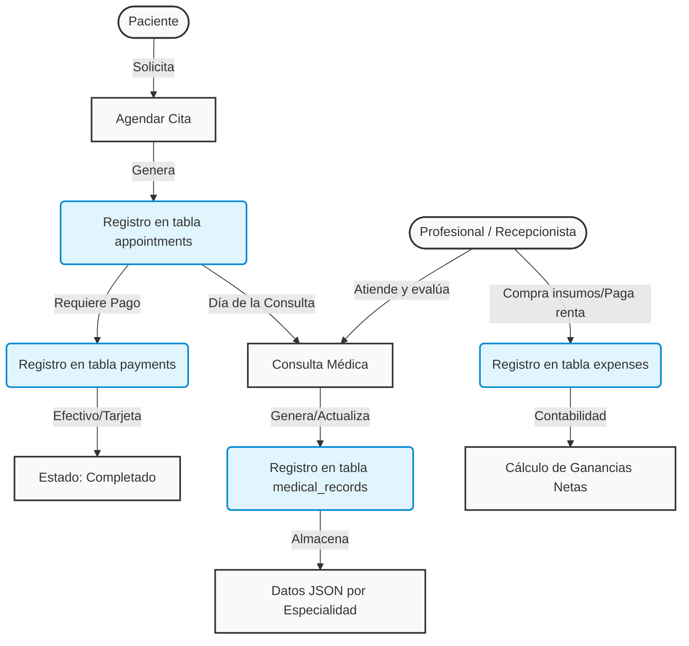
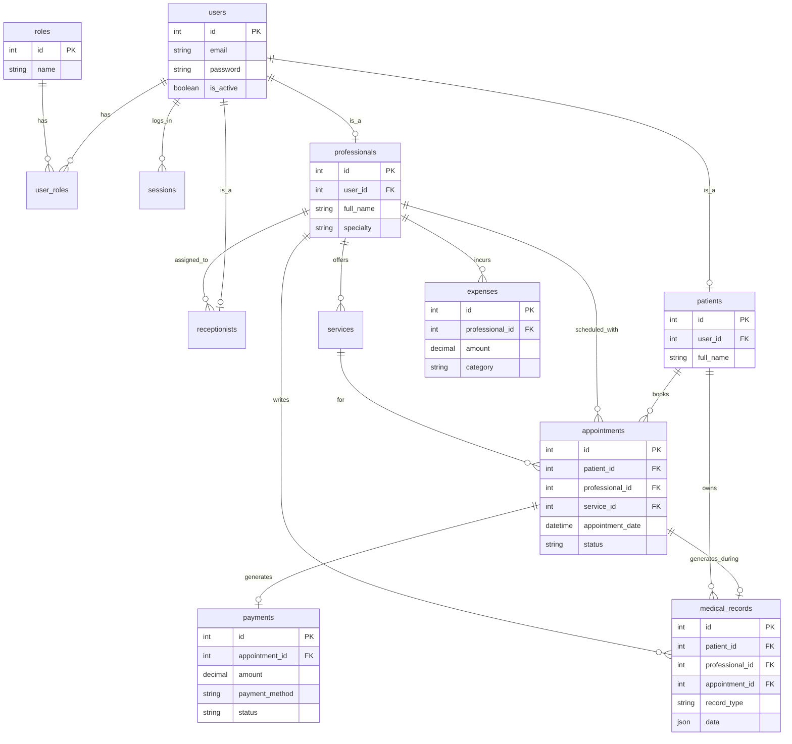

# Esquemas y Flujo del Sistema Healty API

## 🎯 Finalidad Principal del Sistema
El sistema tiene como objetivo principal servir de plataforma integral para la gestión de clínicas y consultorios médicos. Conecta a diferentes tipos de usuarios (Pacientes, Profesionales, Recepcionistas y Administradores), permitiendo coordinar citas médicas, procesar pagos por los servicios, mantener un historial clínico detallado (expedientes médicos personalizables por especialidad), y llevar un control financiero de los gastos operativos de los profesionales.

---

## 🔄 Flujo Principal del Sistema

A continuación se ilustra el flujo de negocio principal desde que un paciente solicita una cita hasta que se genera el expediente y el pago, así como el registro paralelo de gastos del profesional:

---

## 🗄️ Diagrama de Entidad-Relación (ER)

El siguiente diagrama muestra cómo se relacionan todas las entidades a nivel de base de datos.

---

## 📖 Diccionario de Tablas

### Módulo de Autenticación y Usuarios
*   **`roles`**: Catálogo de roles del sistema (`Admin`, `Professional`, `Receptionist`, `Patient`, `Root`).
*   **`users`**: Almacena las credenciales principales (email y contraseña) de cualquier tipo de usuario.
*   **`user_roles`**: Tabla intermedia que permite que un usuario tenga múltiples roles.
*   **`sessions`**: Control de sesiones activas (Tokens JWT, IPs, dispositivos).

### Módulo de Perfiles
*   **`professionals`**: Perfil extendido de los médicos/especialistas. Guarda su especialidad y cédula.
*   **`receptionists`**: Perfil del personal de apoyo, puede estar asignado a un profesional específico.
*   **`patients`**: Perfil de los pacientes. Almacena fecha de nacimiento, género y contacto de emergencia.

### Módulo de Citas y Servicios
*   **`services`**: Catálogo de servicios configurados por cada profesional (con precio y duración).
*   **`appointments`**: Tabla central que vincula a un paciente, un profesional y un servicio en una fecha y hora determinadas.

### Módulo Clínico y Financiero
*   **`medical_records`**: Almacena los expedientes clínicos de los pacientes. Utiliza un campo `data` de tipo `JSON` para ser flexible a cualquier especialidad médica.
*   **`payments`**: Registra los pagos vinculados a una cita (`appointment_id`).
*   **`expenses`**: Registra los gastos operativos reportados por un profesional, lo que permite posteriormente generar reportes financieros de ganancias vs. gastos.
